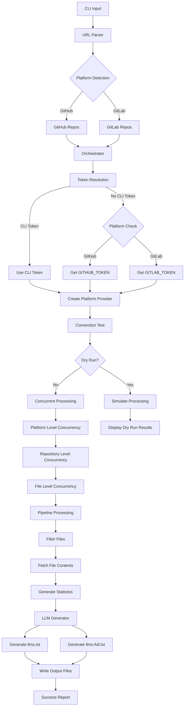

# Sherpa

<div align="center">
  
  <br />
  <strong>Code In, Context Out: Git-to-LLM Made Simple</strong>
  <br />
  <br />
</div>

Sherpa is a lightweight Go CLI tool that transforms your private repositories into LLM-ready context files. Generate `llms.txt` and `llms-full.txt` files from GitLab and GitHub repositories with lightning-fast concurrent processing.

## Features

- 🚀 **Multi-Platform Support** - Works seamlessly with GitHub, GitLab, and self-hosted instances
- ⚡ **High-Performance Concurrent Processing** - Process multiple repositories and files simultaneously
- 🔐 **Private Repository Access** - Secure token-based authentication
- 📁 **Smart File Processing** - Intelligent filtering with built-in `.gitignore` support
- 🎯 **Dual Output Formats** - Generate both metadata (`llms.txt`) and full content (`llms-full.txt`) files
- 🛠️ **Highly Configurable** - Extensive CLI flags and YAML configuration support

## Quick Start

### Installation

```bash
go install github.com/axelbellec/sherpa@latest
```

### Development

This project uses [Task](https://taskfile.dev/) for development workflow:

```bash
# Install Task if not already available
go install github.com/go-task/task/v3/cmd/task@latest

# List available tasks
task

# Display project info (name and version)
task info

# Build the project binary
task build

# Install locally (builds first)
task install

# Run tests
task tests
```

### Basic Usage

```bash
# GitHub repository
sherpa fetch owner/repo --token $GITHUB_TOKEN

# GitLab repository
sherpa fetch https://gitlab.com/owner/repo --token $GITLAB_TOKEN

# Multiple repositories with high concurrency
sherpa fetch repo1 repo2 repo3 \
  --max-repos-concurrency 10 \
  --max-files-concurrency 50 \
  --token $GITHUB_TOKEN
```

## Examples

### Single Repository

```bash
# Fetch a GitHub repository
sherpa fetch microsoft/vscode --token $GITHUB_TOKEN --output ./context

# Fetch a GitLab repository with custom ignore patterns
sherpa fetch gitlab-org/gitlab --token $GITLAB_TOKEN \
  --ignore "*.test.js,node_modules/,*.log"
```

### Multiple Repositories

```bash
# Process multiple repositories concurrently
sherpa fetch \
  facebook/react \
  vercel/next.js \
  microsoft/typescript \
  --max-repos-concurrency 8 \
  --token $GITHUB_TOKEN
```

### Self-Hosted Instances

```bash
# GitLab Enterprise
sherpa fetch internal/backend-api \
  --token $GITLAB_TOKEN \
  --base-url https://gitlab.company.com

# GitHub Enterprise
sherpa fetch enterprise/frontend \
  --token $GITHUB_TOKEN \
  --base-url https://github.company.com/api/v3
```

## Configuration

### Environment Variables

```bash
export GITHUB_TOKEN=ghp_xxxxxxxxxxxx
export GITLAB_TOKEN=glpat_xxxxxxxxxxxx
```

### Configuration File (.sherpa.yml)

```yaml
gitlab:
  base_url: https://gitlab.company.com
  token_env: GITLAB_TOKEN

github:
  base_url: https://api.github.com
  token_env: GITHUB_TOKEN

processing:
  ignore:
    - "*.log"
    - "node_modules/"
    - "vendor/"
    - ".git/"
  max_concurrency: 20

output:
  directory: "./sherpa-output"
  organize_by_date: true
```

## Output

Sherpa generates two types of files:

### `llms.txt` - Repository Metadata

Contains file structure, sizes, and metadata—perfect for LLM context understanding.

### `llms-full.txt` - Complete Content

Includes full file contents for comprehensive code analysis and debugging.

```
sherpa-output/
├── repo-name/
│   ├── llms.txt           # Metadata and structure
│   └── llms-full.txt      # Full file contents
└── another-repo/
    ├── llms.txt
    └── llms-full.txt
```

## Architecture

Sherpa follows a modular architecture with clear separation of concerns:

### Core Components

- **Orchestration Layer** (`internal/orchestration/coordinator.go`): Central coordinator that manages the entire processing pipeline
- **Adapters** (`internal/adapters/`): Platform-specific clients for GitHub and GitLab APIs
- **Pipeline** (`internal/pipeline/`): Repository fetching, filtering, and processing logic
- **Generators** (`internal/generators/`): LLM output file generation

### Token Management

The orchestration layer handles platform-specific token retrieval:
- CLI token (`--token` flag) takes precedence and works for all platforms
- Falls back to platform-specific environment variables (`GITHUB_TOKEN`, `GITLAB_TOKEN`)
- Validates tokens through connection testing before processing

### Processing Flow



1. **Repository Parsing**: URLs are parsed to determine platform (GitHub/GitLab) and extract repository information
2. **Token Resolution**: Platform-specific tokens are retrieved from CLI flags or environment variables
3. **Provider Creation**: Platform adapters are instantiated with appropriate base URLs and tokens
4. **Concurrent Processing**: Three-tier concurrency model processes repositories efficiently:
   - **Platform Level**: GitHub and GitLab repositories processed simultaneously
   - **Repository Level**: Multiple repositories per platform processed concurrently (default: 5)
   - **File Level**: Multiple files per repository fetched in parallel (default: 20)
5. **Output Generation**: LLM-ready files (`llms.txt` and `llms-full.txt`) generated concurrently

## Performance

Sherpa is built for speed with three-tier concurrent processing:

- **Platform Level**: Processes GitHub and GitLab simultaneously
- **Repository Level**: Handles multiple repositories concurrently (default: 5)
- **File Level**: Fetches multiple files per repository in parallel (default: 20)

## CLI Reference

```bash
Flags:
  -t, --token string                    Personal access token
  -o, --output string                   Output directory (default "./sherpa-output")
      --base-url string                 Custom base URL for self-hosted instances
      --ignore string                   Comma-separated ignore patterns
      --include-only string             Include only matching patterns
  -c, --config string                   Configuration file path
  -m, --max-repos-concurrency int      Max concurrent repositories (default 5)
      --max-files-concurrency int      Max concurrent files per repo (default 20)
  -v, --verbose                         Verbose output
  -q, --quiet                           Suppress progress output
```

## Next Steps

- 🏷️ **Tag Support** - Ability to fetch specific tags or releases

## Contributing

We welcome contributions! Please see our [Contributing Guide](CONTRIBUTING.md) for details.

## License

MIT License - see [LICENSE](LICENSE) for details.
