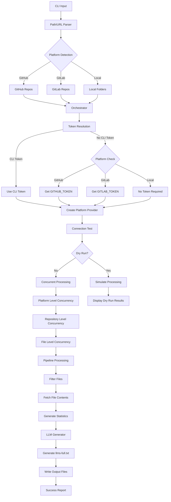

# Sherpa

<div align="center">
  
  <br />
  <strong>Code In, Context Out: Git-to-LLM Made Simple</strong>
  <br />
  <br />
</div>

Sherpa is a fast, lightweight CLI tool written in Go that helps you convert your private GitHub and GitLab repositories, as well as local folders, into LLM-ready context files. It generates comprehensive `llms-full.txt` files using blazing-fast concurrent processing.

Just like a mountain sherpa guides climbers through challenging terrain, Sherpa (the tool) guides your code from raw repositories and local projects to structured, LLM-consumable knowledge. Transform scattered codebases into organized context that AI can understand and work with effectively.

## Features

- 🚀 **Multi-Platform Support** - Works seamlessly with GitHub, GitLab, self-hosted instances, and local folders
- ⚡ **High-Performance Concurrent Processing** - Process multiple repositories and files simultaneously
- 🔐 **Private Repository Access** - Secure token-based authentication for remote repositories
- 📁 **Smart File Processing** - Intelligent filtering with built-in `.gitignore` support
- 🏠 **Local Folder Support** - Process local directories without requiring git or remote access
- 🎯 **Comprehensive Output** - Generate complete context files with full content and metadata
- 🛠️ **Highly Configurable** - Extensive CLI flags and YAML configuration support

## Quick Start

### Installation

```bash
go install github.com/axelbellec/sherpa@latest
```

### Development

This project uses [Task](https://taskfile.dev/) for development workflow:

```bash
# Install Task if not already available
go install github.com/go-task/task/v3/cmd/task@latest

# List available tasks
task

# Display project info (name and version)
task info

# Build the project binary
task build

# Install locally (builds first)
task install

# Run tests
task tests
```

### Basic Usage

```bash
# GitHub repository
sherpa owner/repo --token $GITHUB_TOKEN

# GitLab repository
sherpa https://gitlab.com/owner/repo --token $GITLAB_TOKEN

# Local folder
sherpa /path/to/my/project
sherpa ./src/backend
sherpa ~/my-projects/frontend

# Multiple repositories with high concurrency
sherpa repo1 repo2 repo3 \
  --max-repos-concurrency 10 \
  --max-files-concurrency 50 \
  --token $GITHUB_TOKEN
```

## Examples

### Single Repository

```bash
# Process a GitHub repository
sherpa microsoft/vscode --token $GITHUB_TOKEN --output ./context

# Process a GitLab repository with custom ignore patterns
sherpa gitlab-org/gitlab --token $GITLAB_TOKEN \
  --ignore "*.test.js,node_modules/,*.log"

# Process a local folder
sherpa ~/my-projects/web-app --output ./context

# Process current directory
sherpa . --output ./context
```

### Multiple Repositories and Local Folders

```bash
# Process multiple repositories concurrently
sherpa \
  facebook/react \
  vercel/next.js \
  microsoft/typescript \
  --max-repos-concurrency 8 \
  --token $GITHUB_TOKEN

# Mix remote repositories and local folders
sherpa \
  facebook/react \
  ~/my-projects/backend \
  ./frontend \
  --token $GITHUB_TOKEN

# Process multiple local folders
sherpa \
  ~/projects/frontend \
  ~/projects/backend \
  ~/projects/shared \
  --max-repos-concurrency 10
```

### Self-Hosted Instances

```bash
# GitLab Enterprise
sherpa internal/backend-api \
  --token $GITLAB_TOKEN \
  --base-url https://gitlab.company.com

# GitHub Enterprise
sherpa enterprise/frontend \
  --token $GITHUB_TOKEN \
  --base-url https://github.company.com/api/v3
```

### Local Development Workflows

```bash
# Process current project with dependencies
sherpa . ../shared-library --output ./debug-context

# Process multiple local microservices
sherpa \
  ./services/auth \
  ./services/payment \
  ./services/notification \
  --max-repos-concurrency 5

# Mix local and remote for full context
sherpa \
  . \
  ../shared-utils \
  company/shared-configs \
  --token $GITHUB_TOKEN
```

## Configuration

### Environment Variables

```bash
export GITHUB_TOKEN=ghp_xxxxxxxxxxxx
export GITLAB_TOKEN=glpat_xxxxxxxxxxxx
```

### Configuration File (.sherpa.yml)

```yaml
gitlab:
  base_url: https://gitlab.company.com
  token_env: GITLAB_TOKEN

github:
  base_url: https://api.github.com
  token_env: GITHUB_TOKEN

# Local folder processing settings
local:
  follow_symlinks: false
  max_file_size: 10MB
  include_hidden: false

processing:
  ignore:
    - "*.log"
    - "node_modules/"
    - "vendor/"
    - ".git/"
    - "build/"
    - "dist/"
    - "*.min.js"
    - "*.min.css"
  max_concurrency: 20

output:
  directory: "./sherpa-output"
  organize_by_date: true
```

## Output

Sherpa generates comprehensive context files:

### `llms-full.txt` - Complete Repository Context

Includes full file contents, structure, and metadata for comprehensive code analysis and debugging.

```
sherpa-output/
├── repo-name/
│   └── llms-full.txt      # Complete repository context
├── my-local-project/
│   └── llms-full.txt      # Local folder context
└── another-repo/
    └── llms-full.txt
```

## Architecture

Sherpa follows a modular architecture with clear separation of concerns:

### Core Components

- **Orchestration Layer** (`internal/orchestration/coordinator.go`): Central coordinator that manages the entire processing pipeline
- **Adapters** (`internal/adapters/`): Platform-specific clients for GitHub, GitLab, and local filesystem
- **Pipeline** (`internal/pipeline/`): Repository fetching, filtering, and processing logic
- **Generators** (`internal/generators/`): LLM output file generation

### Platform Support

- **GitHub Adapter** (`internal/adapters/github/`): GitHub API integration with OAuth2 authentication
- **GitLab Adapter** (`internal/adapters/gitlab/`): GitLab API integration with token authentication
- **Local Adapter** (`internal/adapters/local/`): Local filesystem processing with concurrent file reading

### Token Management

The orchestration layer handles platform-specific token retrieval:

- CLI token (`--token` flag) takes precedence and works for all remote platforms
- Falls back to platform-specific environment variables (`GITHUB_TOKEN`, `GITLAB_TOKEN`)
- Local folders require no authentication or tokens
- Validates tokens through connection testing before processing

### Processing Flow



1. **Path/URL Parsing**: Input is parsed to determine platform (GitHub/GitLab/Local) and extract repository or folder information
2. **Platform Detection**: Automatic detection of local paths vs. remote URLs
3. **Token Resolution**: Platform-specific tokens are retrieved (not needed for local folders)
4. **Provider Creation**: Platform adapters are instantiated with appropriate configuration
5. **Concurrent Processing**: Three-tier concurrency model processes repositories and folders efficiently:
   - **Platform Level**: GitHub, GitLab, and local folders processed simultaneously
   - **Repository Level**: Multiple repositories/folders per platform processed concurrently (default: 5)
   - **File Level**: Multiple files per repository/folder fetched in parallel (default: 20)
6. **Output Generation**: Comprehensive LLM-ready context files (`llms-full.txt`) generated with complete information

## Performance

Sherpa is built for speed with three-tier concurrent processing:

- **Platform Level**: Processes GitHub, GitLab, and local folders simultaneously
- **Repository Level**: Handles multiple repositories/folders concurrently (default: 5)
- **File Level**: Fetches multiple files per repository/folder in parallel (default: 20)

### Local Folder Performance

- **Direct filesystem access** - No API rate limits or network overhead
- **Concurrent file reading** - Multiple files processed simultaneously
- **Intelligent binary detection** - Skips binary files automatically
- **Symlink handling** - Configurable symlink following (disabled by default)

## CLI Reference

```bash
Flags:
  -t, --token string                    Personal access token (not required for local folders)
  -o, --output string                   Output directory (default "./sherpa-output")
      --base-url string                 Custom base URL for self-hosted instances
      --ignore string                   Comma-separated ignore patterns
      --include-only string             Include only matching patterns
  -c, --config string                   Configuration file path
  -m, --max-repos-concurrency int      Max concurrent repositories/folders (default 5)
      --max-files-concurrency int      Max concurrent files per repo/folder (default 20)
  -v, --verbose                         Verbose output
  -q, --quiet                           Suppress progress output
```

### Path Formats

Sherpa automatically detects and handles various input formats:

**Remote Repositories:**

- `https://github.com/owner/repo`
- `https://gitlab.com/owner/repo`
- `git@github.com:owner/repo.git`
- `owner/repo` (assumes GitHub)
- `project-name` (assumes GitLab)

**Local Folders:**

- `/absolute/path/to/folder`
- `./relative/path`
- `../parent/folder`
- `~/home/folder`
- `.` (current directory)
- `C:\Windows\Path` (Windows)

## Next Steps

- 🏷️ **Tag Support** - Ability to fetch specific tags or releases
- 🔄 **Watch Mode** - Monitor local folders for changes and auto-regenerate context
- 🔗 **Symlink Support** - Enhanced symlink handling with cycle detection

## License

MIT License - see [LICENSE](LICENSE) for details.

---

<br />
<div align="center" style="text-align: left;">
  <div style="background-color: #fff3cd; border: 1px solid #ffeaa7; border-radius: 8px; padding: 16px; margin-bottom: 24px; color: #856404;">
    <strong>🧸 Toy Project</strong>
    <br />
    This is my personal toy project where I'm having fun learning Go and building cool stuff. Don't expect production-ready code – it's all about experimenting and playing around!
  </div>
</div>
